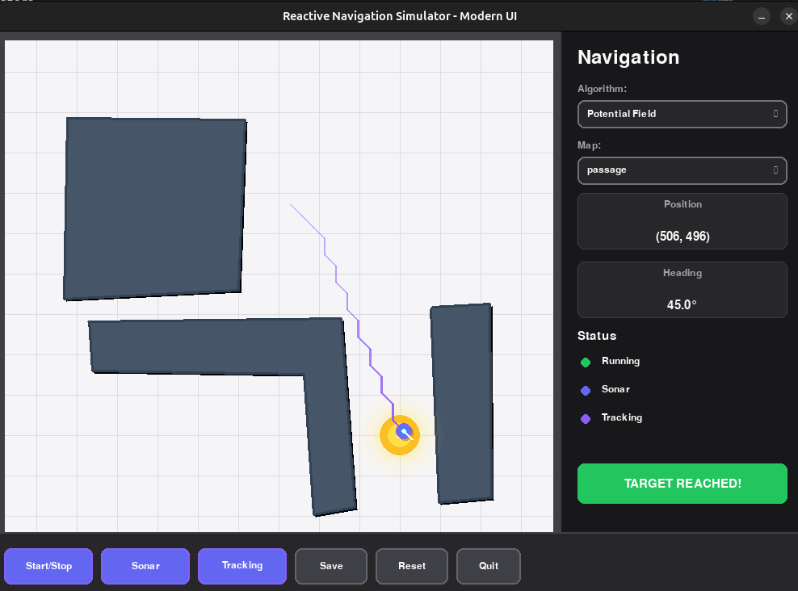
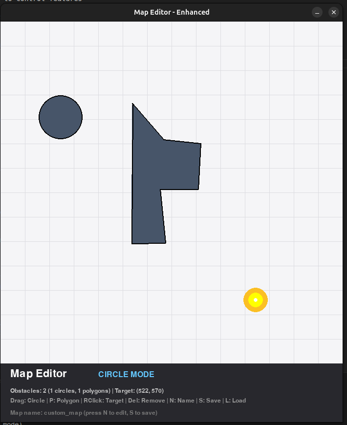

# Reactive Navigation Simulator - Modern UI Edition

A modern Python-based robot navigation simulator with a **beautiful, polished UI** and **pluggable algorithm system**. Write and test your own navigation algorithms!

## ✨ Modern UI Features

- 🎨 **Dark mode theme** with professional color palette
- 📱 **Dropdown menu** for easy algorithm selection
- ✨ **Visual effects**: glowing target, gradient paths, shadows
- 🎯 **Smooth animations** running at 60 FPS
- 💎 **Polished interface** with rounded corners and hover effects

## Features

- 🎮 **Interactive GUI** with real-time visualization
- 🔌 **Pluggable algorithm system** - easily write and test custom navigation algorithms
- 🎯 **5 built-in algorithms**:
  - **Potential Field Navigation** (recommended - best performance with tangential forces and stuck detection)
  - Reactive Navigation (random & target-centric)
  - Simple Target Seeking
  - Wall Following (right-hand rule)
- 📊 **Visual feedback** with color-coded sonar, path tracking, and live stats
- 🗺️ **Custom environments** with obstacles and targets
- 💾 **Path recording** and analysis
- 🎯 **8-directional movement** - robot moves in 45-degree increments for cleaner navigation
- 🤖 **RL-ready Gymnasium environment** - train agents with any RL library (PPO, SAC, DQN, etc.)

## Quick Start

### Installation

```bash
# Install dependencies
pip install pygame numpy

# Run the simulator
python -m src.main

# For RL training (optional)
pip install gymnasium
pip install stable-baselines3  # Optional: for RL examples
```

### Interactive Simulator Controls

- **Start/Stop**: Click button or press `SPACE`
- **Algorithm Dropdown**: Select from all available algorithms
- **Manual Control**: Use arrow keys
- **Sonar/Tracking**: Toggle buttons to control features
- **Reset**: Reset robot to starting position
- **Quit**: Click button or press `ESC`

### RL Training Quick Start

**🎯 NEW: Train on Diverse Maps for Better Generalization!**
```bash
# Launch interactive terminal UI (recommended!)
python rl_tui.py
# Select: Train → Multi-Map → Diverse set (6 maps)
# This trains on 6 carefully designed maps for maximum generalization
```

The TUI provides:
- ✨ Interactive menus for training/testing
- 📂 Automatic model detection and selection
- 🗺️ **NEW: Diverse map set (6 curated maps for generalization)**
- 📊 Real-time progress and statistics
- 🎮 No need to remember command-line arguments!

**Why diverse maps?** Single-map training achieves 70% success but fails (0-5%) on new maps. Multi-map training gets 40-60% across ALL maps with true generalization. [Read more →](NEW_MAPS.md)

**⚡ Command Line (Advanced):**
```bash
# Run random baseline
python rl/train_rl.py --mode random --episodes 10

# Train with PPO
python rl/train_rl.py --mode sb3 --timesteps 50000

# Test trained model (headless)
python rl/test_policy_headless.py --model models/ppo_reactive_nav.zip --episodes 100

# Test with visualization
python rl/test_policy_visual.py --model models/ppo_reactive_nav.zip --episodes 10
```

**Documentation:**
- **[TEST_POLICIES.md](rl/TEST_POLICIES.md)** - Quick guide for testing trained policies
- **[RL_GUIDE.md](rl/RL_GUIDE.md)** - Complete RL training documentation
- **[rl/README.md](rl/README.md)** - Detailed examples reference

## Screenshots





**Dark Mode UI:**
- Clean, modern interface
- Algorithm dropdown for easy selection
- Live status indicators
- Glowing target with pulse animation
- Color-coded sonar (green = clear, red = blocked)

## Writing Custom Algorithms

See **[ALGORITHM_GUIDE.md](ALGORITHM_GUIDE.md)** for comprehensive documentation!

### Quick Example

```python
from src.algorithms.base import NavigationAlgorithm
import math

class MyAlgorithm(NavigationAlgorithm):
    def get_name(self):
        return "My Custom Algorithm"

    def compute_direction(self, robot_x, robot_y, robot_radius,
                         robot_heading, environment, sonar):
        # Move toward target
        dx = environment.target.x - robot_x
        dy = environment.target.y - robot_y
        angle = math.degrees(math.atan2(dy, dx))
        return round(angle / 45) * 45 % 360
```

Add to `src/main.py` and it appears in the dropdown!

## Project Structure

```
reactive-nav-sim-modern/
├── src/
│   ├── algorithms/          # Built-in algorithms
│   │   ├── base.py         # Base class
│   │   ├── reactive.py     # Reactive navigation
│   │   ├── simple_target.py
│   │   ├── wall_follower.py
│   │   └── potential_field.py
│   ├── ui_components.py     # Modern UI components
│   ├── modern_renderer.py   # Modern renderer with effects
│   ├── gym_env.py           # RL Gymnasium environment
│   ├── main.py              # Entry point
│   ├── robot.py             # Robot class
│   ├── environment.py       # Environment & obstacles
│   ├── sonar.py             # Sonar sensor
│   └── config.py            # Configuration & colors
├── rl/                      # RL training & testing
│   ├── train_rl.py          # Training script
│   ├── test_policy_headless.py
│   ├── test_policy_visual.py
│   ├── test_random_policy.py
│   ├── README.md            # RL scripts guide
│   ├── RL_GUIDE.md          # Complete RL training guide
│   ├── TEST_POLICIES.md     # Testing guide
│   ├── TUI_GUIDE.md         # Terminal UI guide
│   └── CHANGELOG.md         # RL feature changelog
├── user_algorithms/         # Your custom algorithms go here!
│   └── template.py          # Template for new algorithms
├── maps/                    # Environment maps
├── tools/                   # Map editor and utilities
├── rl_tui.py                # Interactive TUI for RL
├── RL_QUICKREF.md           # Quick reference card
├── ALGORITHM_GUIDE.md       # Algorithm development guide
├── MODERN_UI_GUIDE.md       # UI customization guide
├── QUICK_START.md           # Quick start guide
└── README.md                # This file
```

## Documentation

- **[ALGORITHM_GUIDE.md](ALGORITHM_GUIDE.md)** - Complete guide for writing custom algorithms
- **[RL_GUIDE.md](rl/RL_GUIDE.md)** - RL training guide with Gymnasium environment
- **[MODERN_UI_GUIDE.md](MODERN_UI_GUIDE.md)** - UI features and customization
- **[QUICK_START.md](QUICK_START.md)** - Quick reference guide

## Modern UI Highlights

### Dark Theme
Professional dark mode with carefully chosen colors for readability and aesthetics.

### Algorithm Dropdown
No more cycling! Click the dropdown to see all algorithms and select directly.

### Visual Effects
- **Pulsing target** with animated glow
- **Gradient path trace** that fades over time  
- **Shadows** on robot and obstacles for depth
- **Color-coded sonar** (green=clear, red=blocked)
- **Smooth animations** at 60 FPS

### Status Indicators
Live status with colored dots:
- 🟢 Running
- 🔵 Sonar enabled
- 🟣 Tracking enabled

### Stat Cards
Modern cards showing:
- Current position (x, y)
- Robot heading (degrees)

## Customization

Edit `src/config.py` to change colors:

```python
# Change robot color to red
COLOR_ROBOT = (255, 0, 0)

# Adjust UI background
COLOR_UI_BG = (30, 30, 35)
```

See [MODERN_UI_GUIDE.md](MODERN_UI_GUIDE.md) for full customization options.

## Contributing

Contributions welcome! If you create an interesting algorithm:

1. Add it to `src/algorithms/`
2. Update documentation
3. Submit a pull request

## License

MIT License - feel free to use and modify!

## Built on top of an old project from grad school course: Advance Robot Navigation

Modernized with:
- Dark mode UI with professional design
- Dropdown algorithm selector
- Visual effects and animations
- Plugin architecture for custom algorithms
- Comprehensive documentation

Happy navigating! 🤖✨
